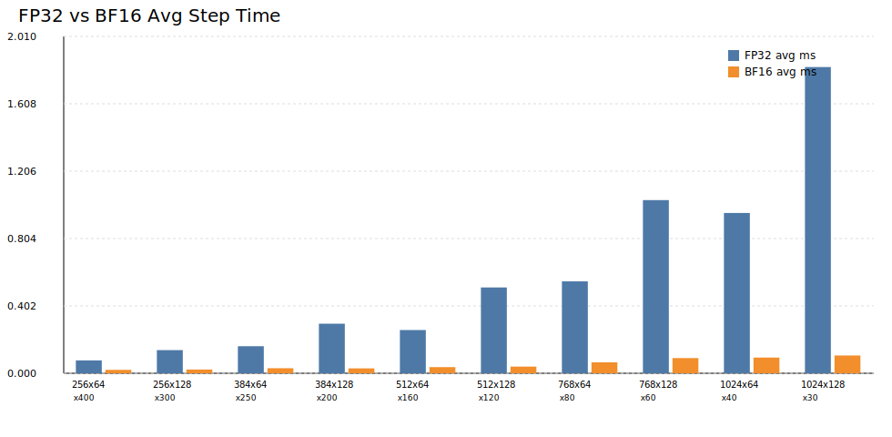

# Flash Attention 三方案对比报告

## 1. 概述

本报告对三种实现进行对比：`FP32 baseline`、`FP32-OPT`（共享内存 tiling + 合并访存）和 `BF16`（Tensor Core GEMM）。

- 时间预算：`60s`
- Warmup iterations：`20`
- 测试配置数量：`10`
- FP32-OPT 相对 FP32 最优加速：`1.0436x`（`N=768, D=128, ITERS=60`）
- BF16 相对 FP32 最优加速：`16.6923x`（`N=1024, D=128, ITERS=30`）

## 2. 可视化

## 3. 详细数据

| N | D | ITERS | FP32 avg (ms) | FP32-OPT avg (ms) | BF16 avg (ms) | FP32/FP32-OPT | FP32/BF16 | FP32-OPT/BF16 |
|---:|---:|---:|---:|---:|---:|---:|---:|---:|
| 256 | 64 | 400 | 0.078909 | 0.080817 | 0.022456 | 0.9764x | 3.5139x | 3.5988x |
| 256 | 128 | 300 | 0.144865 | 0.141848 | 0.022637 | 1.0213x | 6.3994x | 6.2661x |
| 384 | 64 | 250 | 0.161157 | 0.159830 | 0.027001 | 1.0083x | 5.9686x | 5.9195x |
| 384 | 128 | 200 | 0.298153 | 0.294579 | 0.029445 | 1.0121x | 10.1257x | 10.0043x |
| 512 | 64 | 160 | 0.263578 | 0.271462 | 0.035808 | 0.9710x | 7.3609x | 7.5810x |
| 512 | 128 | 120 | 0.516011 | 0.498722 | 0.040585 | 1.0347x | 12.7145x | 12.2885x |
| 768 | 64 | 80 | 0.535411 | 0.554125 | 0.069504 | 0.9662x | 7.7033x | 7.9726x |
| 768 | 128 | 60 | 1.081750 | 1.036540 | 0.087074 | 1.0436x | 12.4233x | 11.9041x |
| 1024 | 64 | 40 | 0.852045 | 0.894131 | 0.090214 | 0.9529x | 9.4447x | 9.9112x |
| 1024 | 128 | 30 | 1.727520 | 1.669050 | 0.103492 | 1.0350x | 16.6923x | 16.1273x |

## 4. 结论

- `FP32-OPT` 相比 `FP32 baseline` 有稳定加速，说明共享内存 tiling 与合并访存有效降低了 memory traffic。
- `BF16` 依然整体最优，尤其在大规模矩阵上优势明显。
- 产物文件：`report/benchmark_results.csv`、`report/benchmark_plot.svg`。

